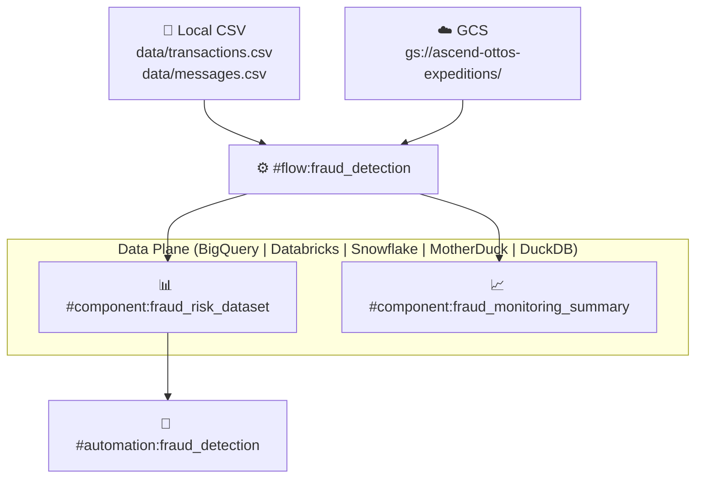
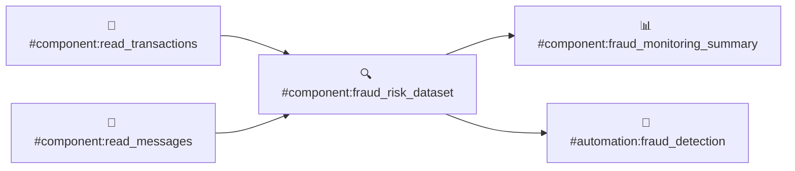
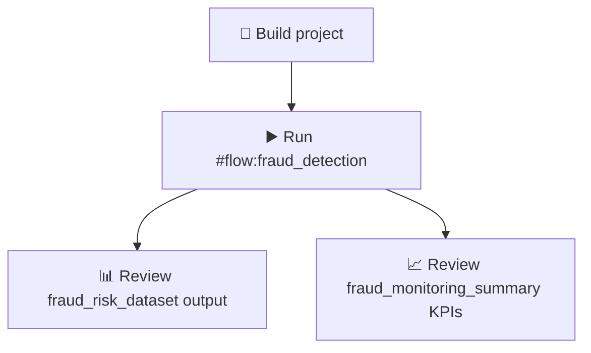

# 🛡️ Agentic Fraud Detection Pipeline

> Combining transaction and behavioral signals to identify financial exploitation and automate risk monitoring across BigQuery, Databricks, Snowflake, MotherDuck, DuckDB, and GCS.

[](#fraud-detection-flow)
[](#connections)
[](#operational-checklist)

---

## 📋 Table of Contents

- [What this project does](#what-this-project-does)
- [Architecture overview](#architecture-overview)
- [Repository layout](#repository-layout)
- [Runtime and platform model](#runtime-and-platform-model)
- [Connections](#connections)
- [Fraud detection flow](#fraud-detection-flow)
- [Automations and orchestration](#automations-and-orchestration)
- [Local datasets](#local-datasets)
- [How to run the project](#how-to-run-the-project)
- [How to extend the project](#how-to-extend-the-project)
- [Technical design notes](#technical-design-notes)
- [Operational checklist](#operational-checklist)

---

## 🔍 What this project does

This project is organized around a configurable data plane (BigQuery, Databricks, Snowflake, MotherDuck, or DuckDB), two source connections, and a single fraud detection flow:

- `#connection:read_local_files` supplies local CSV inputs for development and demos
- `#connection:read_gcs_lake` supplies GCS parquet inputs for cloud-based ingestion
- `#flow:fraud_detection` drives end-to-end fraud scoring and monitoring
- `#automation:fraud_detection` schedules the flow to run hourly

At a high level:

1. Source data is read from local CSV files or GCS.
2. Transforms evaluate message and transaction risk signals.
3. Both signals are joined and scored per user.
4. Curated fraud risk outputs are materialized in the active data plane.
5. An automation orchestrates scheduled flow execution.

---

## 🏗️ Architecture overview



---

## 📁 Repository layout

| Path | Purpose |
|------|---------|
| `automations/` | Event-driven and scheduled orchestration definitions |
| `connections/` | Source connection definitions |
| `data/` | Local CSV inputs used by the fraud detection flow |
| `flows/` | Business pipeline and component implementations |
| `profiles/` | Workspace and deployment profile templates |
| `screenshots/` | Placeholder for UI screenshots |

---

## ⚙️ Runtime and platform model

The project defaults all flows to a configurable data plane set by the active profile. The data plane connection name is resolved at runtime from `$parameters.data_plane.connection_name`.

```yaml
# ascend_project.yaml
project:
  name: agentic-fraud-detection-pipeline
  parameters:
    data_plane: {}
  defaults:
    - kind: Flow
      name:
        regex: .*
      spec:
        data_plane:
          connection_name: $parameters.data_plane.connection_name
```

**Implications:**
- New flows inherit the active data plane automatically.
- Switching platforms requires only activating a different profile — no flow changes needed.
- Each platform profile sets `data_plane.connection_name` to the matching connection file.
- SQL components should use the dialect appropriate for the selected platform.

---

## 🔌 Connections

### 🟦 Data plane connections

Each platform has a dedicated parameterized connection. Select the matching profile to activate it.

| Badge | Connection | Platform |
|-------|-----------|----------|
| 🟦 | `#connection:data_plane_bigquery` | Google BigQuery |
| 🟧 | `#connection:data_plane_databricks` | Databricks Unity Catalog |
| 🟨 | `#connection:data_plane_duckdb` | DuckDB |
| 🟩 | `#connection:data_plane_duckdb_postgres` | DuckDB with Postgres metadata |
| 🟪 | `#connection:data_plane_motherduck` | MotherDuck cloud |
| 🩵 | `#connection:data_plane_snowflake` | Snowflake |

Each connection resolves its host, catalog/dataset, and auth from the active profile via the `$<: $parameters.<platform>` pattern:

```yaml
# connections/data_plane_bigquery.yaml
connection:
  bigquery:
    $<: $parameters.bigquery
```

### 🟩 Source connections

| Badge | Connection | Description |
|-------|-----------|-------------|
| 🟨 | `#connection:read_local_files` | Local CSV files in `data/` — used for development and demos |
| 🟩 | `#connection:read_gcs_lake` | GCS bucket at `gs://ascend-ottos-expeditions/` — used for cloud ingestion |

```yaml
# connections/read_local_files.yaml
connection:
  name: read_local_files
  type: local_file
  parameters: {}
```

```yaml
# connections/read_gcs_lake.yaml
connection:
  gcs:
    root: gs://ascend-ottos-expeditions/
```

> [!TIP]
> To switch from local CSV to GCS, update the `connection:` field in any read component YAML from `read_local_files` to `read_gcs_lake`. No transform logic changes are needed.

See [`connections/README.md`](connections/README.md) for the full connection reference and profile mapping.

---

## 🚨 Fraud detection flow

### Flow purpose

`#flow:fraud_detection` is an end-to-end risk-scoring pipeline. It reads two local datasets, independently classifies messaging and transaction behavior, joins them by user, and produces row-level fraud risk outputs.

```yaml
# flows/fraud_detection/fraud_detection.yaml
flow:
  name: fraud_detection
  version: 0.1.0
  description: >-
    End-to-end fraud detection pipeline that joins uploaded transactions and
    messages and computes risk scores.
```

### Flow DAG



### Inputs

The flow reads demo CSV files from the repository:

| File | Component | Purpose |
|------|-----------|---------|
| `data/transactions.csv` | `#component:read_transactions` | Transaction behavior signals |
| `data/messages.csv` | `#component:read_messages` | User message content signals |

```yaml
# flows/fraud_detection/components/read_transactions.yaml
component:
  read:
    connection: read_local_files
    local_file:
      path: data/transactions.csv
```

```yaml
# flows/fraud_detection/components/read_messages.yaml
component:
  read:
    connection: read_local_files
    local_file:
      path: data/messages.csv
```

### Fraud scoring logic

`#component:fraud_risk_dataset` is a pandas-based transform that evaluates two independent risk dimensions and combines them into a single score per user.

#### 🔴 Risk scoring rules

**Message risk** — based on language in `message_text`:

| 🔴 HIGH | 🟡 MEDIUM | 🟢 LOW |
|---------|----------|--------|
| Contains: `urgent`, `wire`, `immediately`, `payment` | Contains: `verify`, `action required` (if not HIGH) | No suspicious terms |

**Transaction risk** — based on `amount` and `is_new_recipient`:

| 🔴 HIGH | 🟡 MEDIUM | 🟢 LOW |
|---------|----------|--------|
| Amount > 1000 **and** new recipient | Amount between 300–1000 | Amount ≤ 300 or known recipient |

**Combined overall score:**

| Message risk | Transaction risk | Overall score |
|-------------|-----------------|--------------|
| 🔴 HIGH | 🔴 HIGH | 🔴 HIGH |
| 🔴 HIGH | any | 🟡 MEDIUM |
| any | 🔴 HIGH | 🟡 MEDIUM |
| 🟡 MEDIUM | 🟡 MEDIUM | 🟡 MEDIUM |
| 🟢 LOW | 🟢 LOW | 🟢 LOW |

#### Output schema

| Column | Type | Description |
|--------|------|-------------|
| `user_id` | string | User identifier (join key) |
| `transaction_id` | string | Transaction identifier |
| `message_id` | string | Message identifier |
| `amount` | float | Transaction dollar amount |
| `message_text` | string | Original message content |
| `transaction_risk_flag` | string | `HIGH` / `MEDIUM` / `LOW` |
| `message_risk_flag` | string | `HIGH` / `MEDIUM` / `LOW` |
| `overall_risk_score` | string | `HIGH` / `MEDIUM` / `LOW` |
| `requires_immediate_review` | bool | `True` when overall score is `HIGH` |
| `risk_reason` | string | Human-readable explanation of the score |

### Fraud monitoring summary

`#component:fraud_monitoring_summary` rolls the dataset into a single-row operational summary suitable for dashboards and health checks.

**Metrics produced:**

- Total processed records
- 🔴 High / 🟡 Medium / 🟢 Low risk counts
- Percentage of high-risk records
- Latest pipeline run timestamp

> [!NOTE]
> `fraud_monitoring_summary` is the recommended source for KPI dashboards. Query it instead of aggregating `fraud_risk_dataset` at query time.

---

## 🤖 Automations and orchestration

| Automation | Trigger | Action |
|------------|---------|--------|
| `#automation:fraud_detection` | Hourly cron (`0 * * * *`) | Runs `#flow:fraud_detection` |

```yaml
# automations/fraud_detection.yaml
automation:
  name: fraud_detection
  enabled: true
  triggers:
    sensors:
      - type: timer
        name: daily-fraud-detection
        config:
          schedule:
            cron: 0 * * * *
  actions:
    - type: run_flow
      name: run-fraud-detection
      config:
        flow: fraud_detection
```

> [!WARNING]
> Review the `enabled: true` flag before deploying to production. Disable automations in environments where scheduled runs are not intended.

---

## 📂 Local datasets

| File | Used by | Columns |
|------|---------|---------|
| `data/transactions.csv` | `#flow:fraud_detection` | `user_id`, `transaction_id`, `amount`, `is_new_recipient` |
| `data/messages.csv` | `#flow:fraud_detection` | `user_id`, `message_id`, `message_text` |

> [!NOTE]
> The CSV files in this repository are demo stubs. Replace the file contents with real data or swap the read components for a cloud storage connection to run the pipeline against production data.

---

## 🚀 How to run the project

### Prerequisites

- Active workspace with profile parameters set
- Source connections valid
- Project in `ready` build state

### Steps

1. Open the workspace tied to this project.
2. Confirm profile parameters are configured.
3. Build the project.
4. Run `#flow:fraud_detection`.
5. Review the `fraud_risk_dataset` output.

### Recommended execution order



---

## 🔧 How to extend the project

### Switch the data plane platform

1. Copy the appropriate profile template from `profiles/` (e.g., `profiles/snowflake_template.yaml`).
2. Fill in your platform-specific credentials (account, warehouse, schema, etc.).
3. Activate the profile in your workspace.
4. All flows automatically inherit the new data plane — no flow-level changes required.

### Add a new fraud signal

1. Add a new field to `data/transactions.csv` or `data/messages.csv`, or introduce a new read component.
2. Extend `#component:fraud_risk_dataset` with an additional risk flag column.
3. Update `risk_reason` logic to preserve explainability.
4. Add or tighten component tests.

### Add a new input source

1. Add a new connection definition under `connections/`.
2. Add a read component under `flows/fraud_detection/components/`.
3. Wire the new component into `fraud_risk_dataset` as an additional input.

### Add a downstream action

1. Create a new automation under `automations/`.
2. Trigger it from a completed flow run or a threshold condition on `fraud_risk_dataset`.

---

## 🧠 Technical design notes

### Why this project is useful

This repository is a compact working example of several Ascend patterns:

- YAML read components for local file ingestion
- Pandas Python transforms with data quality tests
- Event-driven automations around a central business pipeline
- Explainable risk scoring with `risk_reason` and `requires_immediate_review` flags

### Data modeling style

The project favors:

- Simple, explicit component boundaries
- Curated outputs with clear business meaning
- Small, readable transforms over heavily abstracted logic
- Explainability columns alongside every risk score

### Risk scoring design

Scoring is intentionally two-dimensional and independently computed so that each signal can be adjusted without breaking the other. The `overall_risk_score` is derived last from the two independent flags, making the logic auditable.

---

## ✅ Operational checklist

- [ ] Active profile selected and platform parameters configured
- [ ] Data plane connection valid (`#connection:data_plane_<platform>`)
- [ ] `#connection:read_local_files` valid and pointing to `data/` (or `#connection:read_gcs_lake` for cloud ingestion)
- [ ] Project build in `ready` state
- [ ] `#flow:fraud_detection` run completed successfully
- [ ] `#component:fraud_risk_dataset` contains expected rows
- [ ] `#component:fraud_monitoring_summary` shows correct KPIs
- [ ] `#automation:fraud_detection` enabled only in appropriate environments

---

## 📄 Related documentation

- [`connections/README.md`](connections/README.md) — connection configuration details

---

## 🗺️ File guide

| File | Why it matters |
|------|----------------|
| `README.md` | Primary project guide (this file) |
| `ascend_project.yaml` | Project name, data plane default, and global settings |
| `flows/fraud_detection/components/fraud_risk_dataset.py` | Main fraud scoring business logic |
| `flows/fraud_detection/fraud_detection.yaml` | Flow definition and metadata |
| `automations/fraud_detection.yaml` | Hourly scheduling automation |
| `connections/data_plane_bigquery.yaml` | BigQuery data plane connection |
| `connections/data_plane_databricks.yaml` | Databricks data plane connection |
| `connections/data_plane_duckdb.yaml` | DuckDB data plane connection |
| `connections/data_plane_duckdb_postgres.yaml` | DuckDB + Postgres data plane connection |
| `connections/data_plane_motherduck.yaml` | MotherDuck data plane connection |
| `connections/data_plane_snowflake.yaml` | Snowflake data plane connection |
| `connections/read_local_files.yaml` | Local CSV source connection |
| `connections/read_gcs_lake.yaml` | GCS source connection |
| `profiles/bigquery_template.yaml` | BigQuery profile template |
| `profiles/databricks_template.yaml` | Databricks profile template |
| `profiles/duckdb_template.yaml` | DuckDB profile template |
| `profiles/duckdb_postgres_template.yaml` | DuckDB + Postgres profile template |
| `profiles/motherduck_template.yaml` | MotherDuck profile template |
| `profiles/snowflake_template.yaml` | Snowflake profile template |
| `data/transactions.csv` | Transaction input data |
| `data/messages.csv` | Message input data |
